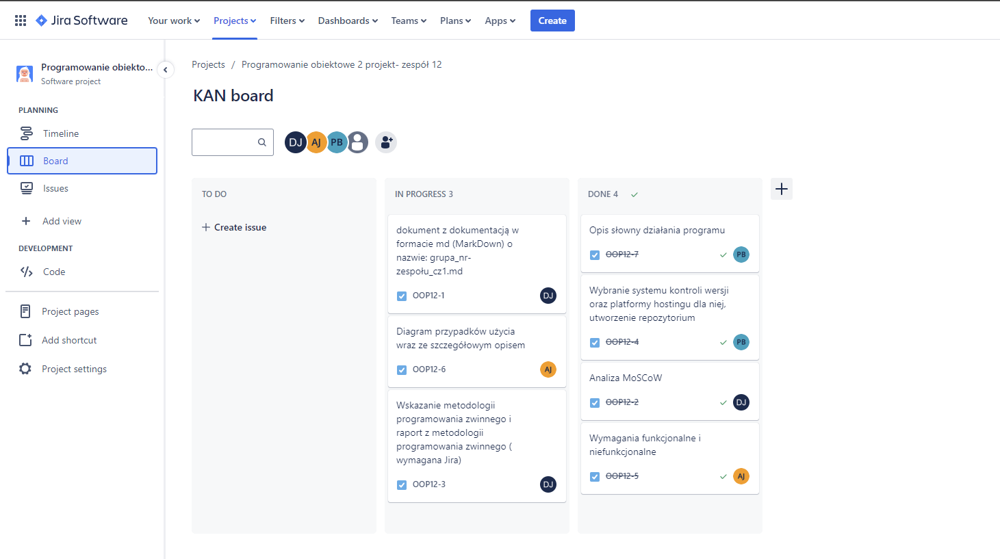
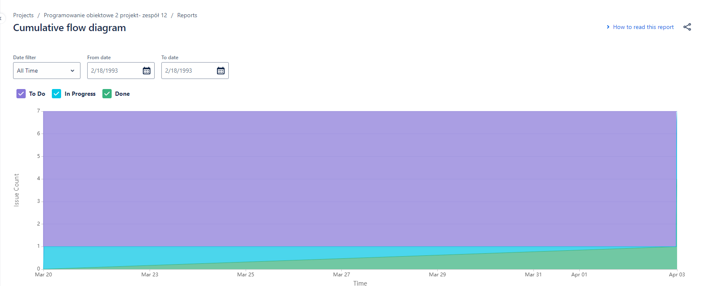

# programowanie-obiektowe-projekt

### 1. Etap 1 - Opis słowny działania programu

Aplikacja umożliwiająca tworzenie różnego typu wykresów, wykorzystująca web scraping ze strony IMDb. Użytkownik będzie miał możliwość filtrowania zakresu danych oraz ich kategorii. Dodatkowo wygląd oraz typ wykresu będą mogły być modyfikowane.

### 2. Etap 2 - Analiza MoSCoW
**MUST have (aplikacja będzie zawierać):**
- Wybór wykresów (kołowy, słupkowy, punktowy), 
- Modyfikacje danych wykresów ,
- Wybór gatunków,
- Wybór rocznika filmów, 
- Określenie ocen

**SHOULD have (aplikacja powinna zawierać):**
**Wyświetlenie wykresów:**

<ul>
<li> Wykres kołowy:
    <ul>
<li>% ocen w przedziale lat, </li>
<li>% ocen w przedziale gatunków, </li> 
<li>% gatunków w przedziale lat</li> 
    </ul>
</li>
</ul>

<ul>
<li>Wykres słupkowy: 
    <ul>
<li>średnia ocen na każdy gatunek,</li>
<li>średnia ocen na każdy rok </li> 
    </ul>
</li>
</ul>

<ul>
<li>Wykres punktowy: 
    <ul>
<li>oś x lata oś y wszystkie opinie,</li>
<li>oś x lata oś y % gatunków </li> 
    </ul>
</li>
</ul>

**COULD have (aplikacja może zawierać):**
- Porównywanie wykresów,
- Zmiana wyglądu wykresu,
- Wybór reżysera

**WON’T have (aplikacja na razie nie będzie zawierać):**
- Analizowania danych z innych stron,
- Analizowania danych z plików zewnętrznych 

### 4. Etap 4 - Wymagania funkcjonalne i niefunkcjonalne
**FURPS - functionality, usability, reliability, performance and supportability** 

Functionality: 
- Wybór danych 
- Wyświetlenie wykresów 
- Modyfikacje danych na wykresach 

Usability: 
- Czytelność i przejrzystość 
- Prostota w użyciu 

Reliability: 
- Stabilność działania komponentów aplikacji poprzez stosowanie zintegrowanych narzędzi programistycznych (Flask) 
- Obsługa wyjątków 

Performance: 
- Optymalizacja działania aplikacji 
- Wydajne przechwytywanie danych ze strony (web scraping) 

Supportability: 
- Możliwość rozbudowywania aplikacji w przyszłości dzięki modułowej strukturze 
- Intuicyjna struktura aplikacji wykorzystująca wzorce projektowe 

### 5. Etap 5 - Wybranie systemu kontroli wersji oraz platformy hostingu dla niej, utworzenie repozytorium

Systemem kontroli wersji użytym w projekcie został **Git**. Głównymi powodami wyboru tego systemu są:

- możliwość jednoczesnej pracy przy kodzie przez kilka osób,
- transferowanie oraz łączenie zmian z różnych branchy,
- szybkość oraz wydajność systemu,
- możliwość pracy offline we własnym repozytorium.

Jako platformę hostingową dla systemu kontroli wersji wybrano **GitHub**. Wybór ten został uwarunkowany jej popularnością, wcześniejszym doświadczeniem z nią oraz szeroką gamą funkcjonalności umożliwiającymi w sposób wydajny rozwój własnego oprogramowania.

### 6. Etap 6- Metodyka programowania zwinnego
Metodyką zarządzania naszym projektem jest metodyka programowania zwinnego - kanban.
Pozwala śledzić postępy prac nad projektem. Wszystkie zadania poruszają się zgodnie z
przepływem w jednym i przechodzą przez kolejne etapy takie jak: analiza, praca w toku,
testowanie oraz wdrożenie. 

**Raport z metodologii programowania zwinnego**
