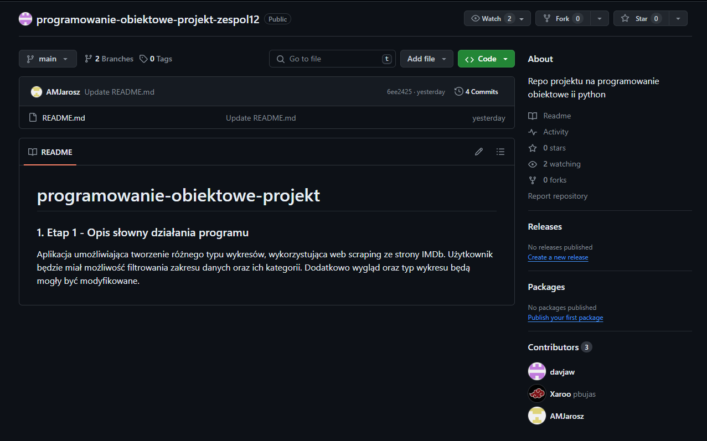

# programowanie-obiektowe-projekt

### 1. Etap 1 - Opis słowny działania programu

Aplikacja umożliwiająca tworzenie różnego typu wykresów, wykorzystująca web scraping ze strony IMDb. Użytkownik będzie miał możliwość filtrowania zakresu danych oraz ich kategorii. Dodatkowo wygląd oraz typ wykresu będą mogły być modyfikowane.

### 5. Etap 5 - Wybranie systemu kontroli wersji oraz platformy hostingu dla niej, &nbsp;&nbsp;&nbsp;&nbsp;utworzenie repozytorium

Systemem kontroli wersji użytym w projekcie został **Git**. Głównymi powodami wyboru tego systemu są:

- możliwość jednoczesnej pracy przy kodzie przez kilka osób,
- transferowanie oraz łączenie zmian z różnych branchy,
- szybkość oraz wydajność systemu,
- możliwość pracy offline we własnym repozytorium.

Jako platformę hostingową dla systemu kontroli wersji wybrano **GitHub**. Wybór ten został uwarunkowany jej popularnością, wcześniejszym doświadczeniem z nią oraz szeroką gamą funkcjonalności umożliwiającymi w sposób wydajny rozwój własnego oprogramowania.

{width=50px}
