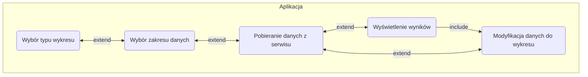
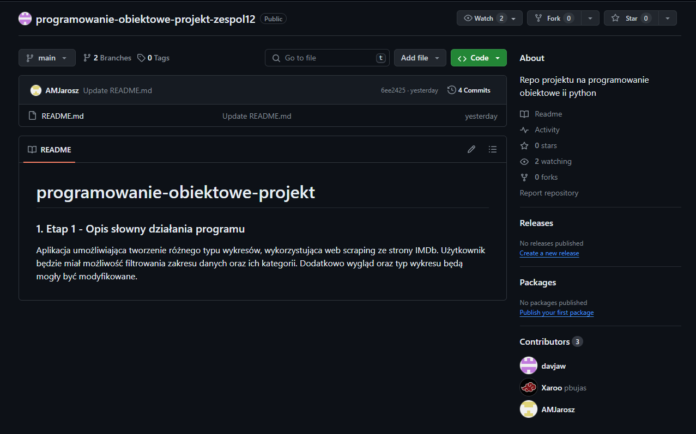
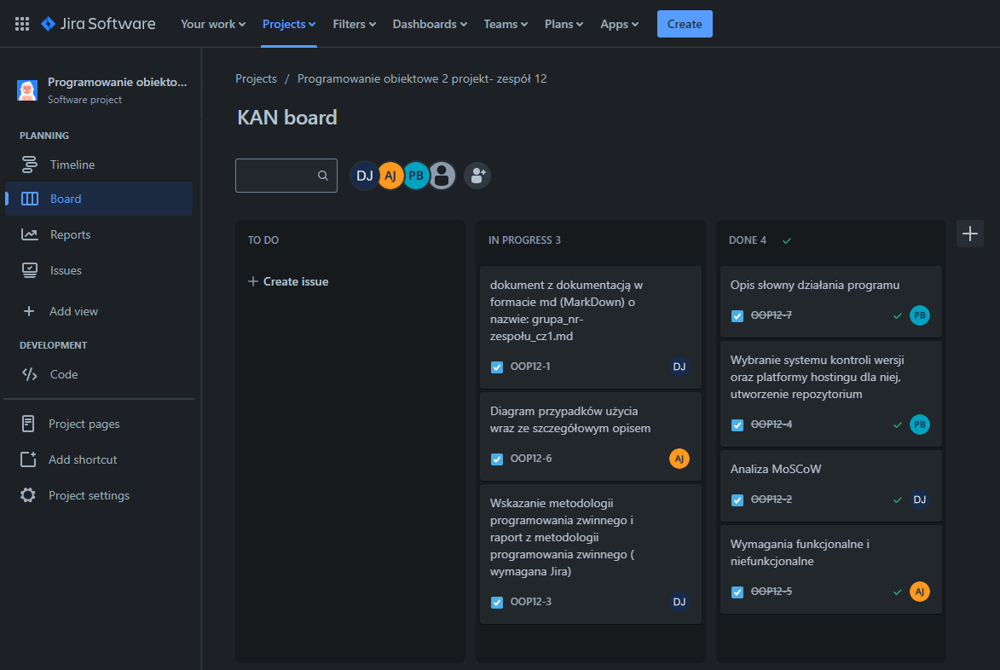
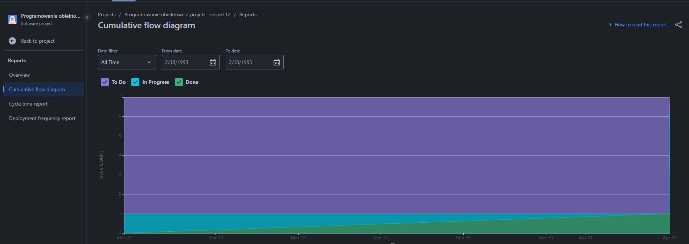
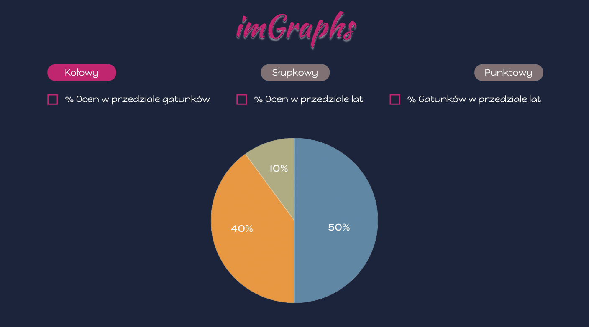

# programowanie-obiektowe-projekt

### 1. Etap 1.1 - Opis słowny działania programu

Aplikacja umożliwiająca tworzenie różnego typu wykresów, wykorzystująca web scraping ze strony IMDb. Użytkownik będzie miał możliwość filtrowania zakresu danych oraz ich kategorii. Dodatkowo wygląd oraz typ wykresu będą mogły być modyfikowane.

### 2. Etap 1.2 - Analiza MoSCoW

**MUST have (aplikacja będzie zawierać):**
- Wybór wykresów (kołowy, słupkowy, punktowy), 
- Modyfikacje danych wykresów,
- Wybór gatunków,
- Wybór rocznika filmów,
- Określenie ocen

**SHOULD have (aplikacja powinna zawierać):**
**Wyświetlenie wykresów:**

<ul>
<li> Wykres kołowy:
    <ul>
<li>% ocen w przedziale lat, </li>
<li>% ocen w przedziale gatunków, </li> 
<li>% gatunków w przedziale lat</li> 
    </ul>
</li>
</ul>

<ul>
<li>Wykres słupkowy: 
    <ul>
<li>średnia ocen na każdy gatunek,</li>
<li>średnia ocen na każdy rok </li> 
    </ul>
</li>
</ul>

<ul>
<li>Wykres punktowy: 
    <ul>
<li>oś x lata oś y wszystkie opinie,</li>
<li>oś x lata oś y % gatunków </li> 
    </ul>
</li>
</ul>

**COULD have (aplikacja może zawierać):**

- Porównywanie wykresów,
- Zmiana wyglądu wykresu,
- Wybór reżysera

**WON’T have (aplikacja na razie nie będzie zawierać):**

- Analizowania danych z innych stron,
- Analizowania danych z plików zewnętrznych

### 3. Etap 1.3 - Diagram przypadków użycia (Use Case)

### 4. Etap 1.4 - Wymagania funkcjonalne i niefunkcjonalne

**FURPS - functionality, usability, reliability, performance and supportability**

Functionality:

- Wybór danych
- Wyświetlenie wykresów
- Modyfikacje danych na wykresach

Usability:

- Czytelność i przejrzystość
- Prostota w użyciu

Reliability:

- Stabilność działania komponentów aplikacji poprzez stosowanie zintegrowanych narzędzi programistycznych (Flask)
- Obsługa wyjątków

Performance:

- Optymalizacja działania aplikacji
- Wydajne przechwytywanie danych ze strony (web scraping)

Supportability:

- Możliwość rozbudowywania aplikacji w przyszłości dzięki modułowej strukturze
- Intuicyjna struktura aplikacji wykorzystująca wzorce projektowe

### 5. Etap 1.5 - Wybranie systemu kontroli wersji oraz platformy hostingu dla niej, utworzenie repozytorium

Systemem kontroli wersji użytym w projekcie został **Git**. Głównymi powodami wyboru tego systemu są:

- możliwość jednoczesnej pracy przy kodzie przez kilka osób,
- transferowanie oraz łączenie zmian z różnych branchy,
- szybkość oraz wydajność systemu,
- możliwość pracy offline we własnym repozytorium

Jako platformę hostingową dla systemu kontroli wersji wybrano **GitHub**. Wybór ten został uwarunkowany jej popularnością, wcześniejszym doświadczeniem z nią oraz szeroką gamą funkcjonalności umożliwiającymi w sposób wydajny rozwój własnego oprogramowania.

### 6. Etap 1.6- Metodyka programowania zwinnego

Metodyką zarządzania naszym projektem jest metodyka programowania zwinnego - kanban.
Pozwala śledzić postępy prac nad projektem. Wszystkie zadania poruszają się zgodnie z
przepływem w jednym i przechodzą przez kolejne etapy takie jak: do zrobienia, praca w toku oraz zrobione.

**Raport z metodologii programowania zwinnego**

### 7. Etap 2.1 - Projekt zawierający wybrane funkcjonalności

Projekt obejmuje funkcjonalności związane z pobieraniem danych z witryny IMDB za pomocą web scrappera, takie jak tytuł, rok produkcji, ocena, ilość opinii oraz miejsce w rankingu. Projekt zawiera również interfejs użytkownika (UI), który jest umieszczony w folderze "view". Obecnie interfejs ten nie zawiera implementacji wykresów ani danych.

### 8. Etap 2.2 - Opracowanie koncepcji wizualnej programu

Koncepcję wizualna programu została opracowana na platformie Figma.  [Wizualizacja](https://www.figma.com/proto/JAzi0V8gRFwkpm3iEuh7k8/ProgOb?node-id=1-2&t=nu1ARWDHplEJ1MEY-1&scaling=contain&page-id=0%3A1&starting-point-node-id=1%3A2) została podzielona na siedem okien, co widać na załączonym obrazku. Użytkownik może wybrać dany typ wykresu oraz jakie dane będą brane pod uwagę. Cała aplikacja polega na web scraping'u bazy IMDb i wyświetlaniu poszczególnych wykresów.

Interfejs użytkownika obejmuje następujące ekrany:

1. **Ekran startowy** - umożliwia wybór rodzaju wykresu (kołowy, słupkowy, punktowy).
2. **Ekrany główne** dla poszczególnych typów wykresów - pozwalają na wybór danych do wizualizacji:

- Wykres kołowy: procent ocen w przedziale gatunków i lat oraz procent gatunków w przedziale lat.
- Wykres słupkowy: średnia ocen na każdy gatunek i rok.
- Wykres punktowy: rozkład procentowy gatunków na każdy rok i liczba wszystkich opinii na każdy rok.

3. **Ekrany z wykresami** - wyświetlają wybrane wykresy na podstawie danych pobranych z IMDb.
   Projekt ma na celu ułatwienie analizy danych filmowych z IMDb poprzez intuicyjną i estetyczną wizualizację.

